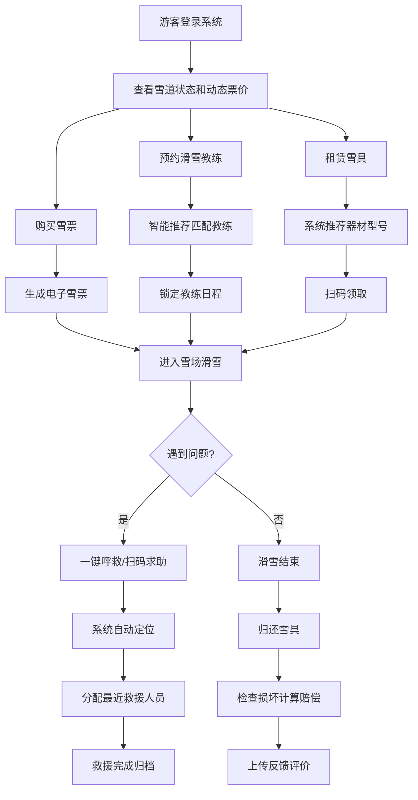

## 1. 产品概述

大型滑雪场智慧运营与安全管理系统，服务于滑雪场全流程数字化运营，支持游客、滑雪教练、雪具管理员、运营经理和财务五种角色协同工作，实现票务动态定价、教练智能预约、雪具租赁管理、雪道安全监控、应急救援调度和财务自动报表等核心功能。

- 解决滑雪场人工运营效率低、安全响应慢、定价僵化等痛点
- 目标用户：滑雪场运营方及滑雪消费者

## 2. 核心功能

### 2.1 用户角色

| 角色 | 登录方式 | 核心权限 |
|------|---------|---------|
| 游客 | 手机号注册登录 | 购票、预约教练、租赁雪具、查看雪道状态、一键呼救 |
| 滑雪教练 | 工号登录 | 查看课表、扫码签到、上传学员反馈、查看收入预估和评价 |
| 雪具管理员 | 工号登录 | 雪具出入库管理、扫码领还、损坏检查与赔偿计算 |
| 运营经理 | 工号登录 | 雪道巡检录入、状态管理、救援调度、运营监控 |
| 财务 | 工号登录 | 查看收入报表、导出凭证、成本分析 |

### 2.2 功能模块

1. **登录与角色切换页**：角色选择、身份验证、权限路由
2. **游客仪表盘**：雪道地图、今日票价、快速购票、教练预约入口、救援按钮
3. **票务系统**：动态票价计算、在线购票、电子雪票、容量管理
4. **教练预约系统**：智能推荐、日程锁定、签到打卡、星级评分
5. **雪具租赁系统**：器材智能推荐、扫码领取、归还检查、赔偿计算
6. **雪道管理系统**：巡检录入、状态自动判断、预警推送
7. **救援调度系统**：一键呼救、自动定位、人员分配、事故归档
8. **财务报表系统**：月度自动统计、多维度对比、手机端推送
9. **消息通知中心**：实时消息推送、凭证下载

### 2.3 页面详情

| 页面名称 | 模块名称 | 功能描述 |
|---------|---------|---------|
| 登录页 | 角色选择卡片 | 五种角色切换，不同入口不同表单 |
| 登录页 | 身份验证表单 | 手机号/工号 + 密码登录，验证码 |
| 游客首页 | 雪道地图可视化 | SVG雪道分布图，实时状态着色 |
| 游客首页 | 动态票价展示 | 根据日期/客流/天气展示今日票价 |
| 游客首页 | 快速购票 | 选择日期和票种，一键下单 |
| 游客首页 | 一键呼救 | 醒目红色按钮，触发救援流程 |
| 购票详情 | 票价计算器 | 动态展示价格构成和优惠 |
| 购票详情 | 支付与电子票 | 模拟支付，生成二维码电子票 |
| 教练预约 | 智能推荐列表 | 根据等级、评分、空闲推荐教练 |
| 教练预约 | 时段选择 | 日历+时段网格，锁定后不可再约 |
| 教练仪表盘 | 今日课表 | 时间轴展示当日课程 |
| 教练仪表盘 | 签到扫码 | 模拟扫码签到功能 |
| 教练仪表盘 | 收入与评价 | 收入预估图表、评价词云 |
| 雪具租赁 | 器材选择 | 雪板、头盔、雪服分类展示 |
| 雪具租赁 | 尺码推荐 | 输入身高体重自动推荐型号 |
| 雪具租赁 | 领取/归还 | 扫码出入库流程 |
| 雪具管理 | 损坏检查 | 损坏等级选择，自动计算赔偿 |
| 运营管理 | 雪道巡检 | 巡检表单，录入雪质、温度、安全状态 |
| 运营管理 | 状态总览 | 所有雪道实时状态看板 |
| 救援调度 | 呼救列表 | 待处理呼救事件实时队列 |
| 救援调度 | 事故归档 | 救援报告和照片上传 |
| 财务报表 | 收入看板 | 雪道/教练/租赁多维度收入图表 |
| 财务报表 | 凭证下载 | 各类单据PDF导出 |
| 消息中心 | 消息列表 | 分类消息，实时推送 |

## 3. 核心流程

### 3.1 游客购票流程
游客选择日期 → 系统根据日期、历史客流、天气预报计算动态票价 → 游客确认支付 → 生成电子雪票（二维码）→ 锁定当日雪道容量

### 3.2 教练预约流程
游客选择滑雪水平和时间段 → 系统根据教练等级、历史评分、空闲时段推荐Top3 → 游客确认预约 → 锁定教练日程 → 推送上课提醒 → 教练扫码签到 → 课后上传反馈 → 系统累计评分生成星级排行

### 3.3 雪具租赁流程
游客选择装备类型 → 输入身高体重 → 系统自动推荐型号和尺码 → 提交预约 → 到店扫码领取 → 归还时管理员检查损坏 → 系统按损坏等级自动计算赔偿 → 生成电子赔偿单

### 3.4 雪道状态管理流程
运营经理录入巡检数据（雪质、温度、能见度）→ 系统结合实时天气和传感器数据 → 自动判断开放/关闭/难度变更 → 立即推送预警给在雪游客和运营人员

### 3.5 救援流程
游客雪道扫码/一键呼救 → 系统自动定位 → 分配最近且资质匹配的救援人员 → 救援人员赶赴现场 → 救援完成上传报告和照片 → 系统更新记录并归档

### 3.6 核心流程Mermaid图

## 4. 用户界面设计

### 4.1 设计风格
- **主色调**：冰雪蓝 (#0EA5E9) + 纯白 (#FFFFFF) + 深灰 (#1E293B)
- **辅助色**：预警橙 (#F97316)、救援红 (#EF4444)、成功绿 (#10B981)
- **按钮风格**：圆角矩形（radius 12px），悬浮微上浮+阴影加深
- **字体**：标题使用 'Noto Sans SC' 粗体，正文使用 'PingFang SC' 常规
- **布局风格**：卡片式布局 + 左侧导航栏 + 顶部状态栏，支持响应式
- **图标风格**：Lucide React 线性图标，统一 20px 尺寸
- **背景**：渐变冰雪蓝 + 细腻噪点纹理，营造雪山氛围

### 4.2 页面设计概览

| 页面名称 | 模块名称 | UI 元素 |
|---------|---------|---------|
| 登录页 | 角色选择 | 五大角色卡片，悬浮发光选中态，冰雪渐变背景 |
| 仪表盘 | 顶部导航 | 角色信息、消息铃铛、全局搜索、主题切换 |
| 仪表盘 | 侧边栏 | 图标+文字导航，当前页高亮蓝色条 |
| 仪表盘 | 数据看板 | 圆角卡片、数据大屏风格、实时数字跳动动画 |
| 雪道地图 | SVG地图 | 分层雪道、状态颜色编码、点击查看详情弹窗 |
| 购票页 | 票价卡片 | 价格大字突出、倒计时动画、淡入渐显 |
| 教练列表 | 教练卡片 | 头像、星级、评分、空闲状态标签、悬浮放大 |
| 救援按钮 | FAB悬浮 | 红色圆形按钮、脉冲呼吸动画、固定右下角 |
| 消息中心 | 通知列表 | 侧滑抽屉、未读红点、分类Tab |

### 4.3 响应式设计
- 桌面端优先（1440px基准），适配到 768px 平板
- 侧边栏在移动端折叠为汉堡菜单
- 数据看板卡片在移动端改为单列纵向堆叠
- 救援按钮在移动端保持固定悬浮，触手可及

### 4.4 动画与交互
- 页面加载：骨架屏 → 内容渐显（staggered 80ms间隔）
- 卡片悬浮：translateY(-2px) + shadow 加深（150ms ease-out）
- 按钮点击：scale(0.97) 回弹反馈
- 状态变更：颜色平滑过渡 + 轻微高亮闪烁
- 消息推送：右上角滑入 + 轻微震动感
