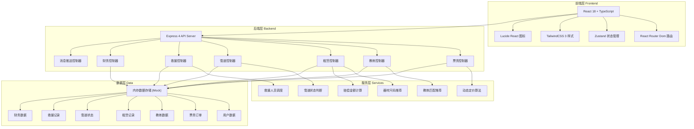
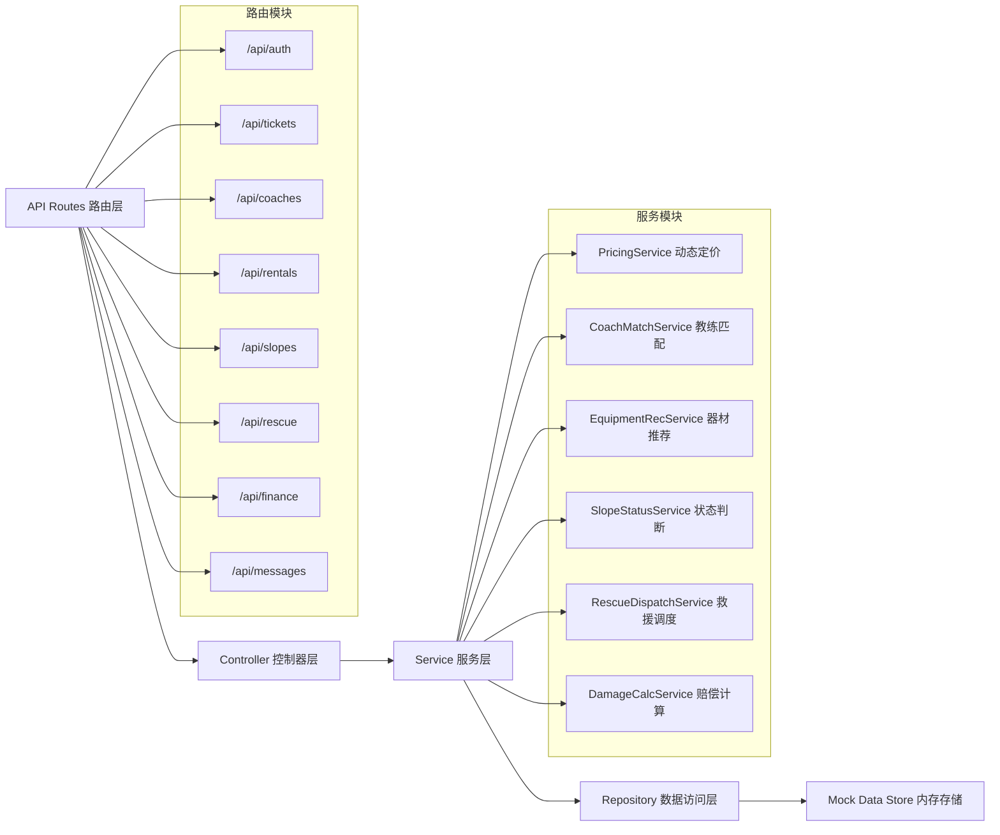
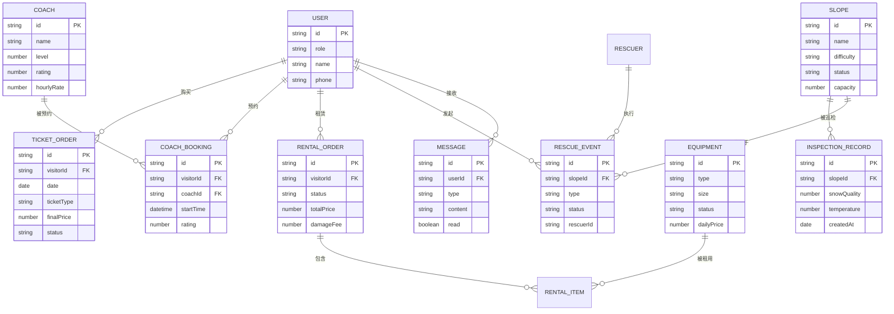

## 1. 架构设计



## 2. 技术描述

- **前端**：React@18 + TypeScript + React Router Dom@6 + Zustand + TailwindCSS@3 + Lucide React
- **构建工具**：Vite 5
- **后端**：Express@4 + TypeScript
- **数据库**：内存Mock数据（开发演示用），可后续扩展SQLite
- **初始化工具**：vite-init (react-express-ts 模板)

## 3. 路由定义

| 路由路径 | 页面用途 | 访问角色 |
|---------|---------|---------|
| /login | 登录与角色选择页 | 所有 |
| /visitor/dashboard | 游客首页仪表盘 | 游客 |
| /visitor/tickets | 票务购买页 | 游客 |
| /visitor/tickets/mine | 我的雪票 | 游客 |
| /visitor/coaches | 教练预约列表 | 游客 |
| /visitor/coaches/my | 我的预约 | 游客 |
| /visitor/rentals | 雪具租赁 | 游客 |
| /visitor/rentals/my | 我的租赁 | 游客 |
| /visitor/slopes | 雪道状态地图 | 游客 |
| /visitor/sos | 一键呼救 | 游客 |
| /coach/dashboard | 教练仪表盘 | 教练 |
| /coach/schedule | 我的课表 | 教练 |
| /coach/checkin | 签到扫码 | 教练 |
| /coach/income | 收入与评价 | 教练 |
| /rental/dashboard | 雪具管理仪表盘 | 管理员 |
| /rental/lend | 扫码领取 | 管理员 |
| /rental/return | 归还检查 | 管理员 |
| /rental/inventory | 库存管理 | 管理员 |
| /manager/dashboard | 运营仪表盘 | 经理 |
| /manager/slopes | 雪道巡检 | 经理 |
| /manager/rescue | 救援调度 | 经理 |
| /finance/dashboard | 财务总览 | 财务 |
| /finance/reports | 运营报表 | 财务 |
| /messages | 消息通知中心 | 所有 |

## 4. API 定义

```typescript
// 用户相关
interface User {
  id: string;
  role: 'visitor' | 'coach' | 'rental_admin' | 'manager' | 'finance';
  name: string;
  phone?: string;
  employeeId?: string;
  avatar?: string;
}

// 票务相关
interface TicketOrder {
  id: string;
  visitorId: string;
  date: string;
  ticketType: 'adult' | 'child' | 'senior' | 'halfday';
  basePrice: number;
  dynamicFactor: number;
  finalPrice: number;
  qrCode: string;
  status: 'paid' | 'used' | 'refunded';
  createdAt: string;
}

interface DynamicPriceParams {
  date: string;
  ticketType: string;
  weather: string;
  historicalFlow: number;
}

// 教练相关
interface Coach {
  id: string;
  name: string;
  level: 1 | 2 | 3 | 4 | 5;
  rating: number;
  ratingCount: number;
  specialties: string[];
  hourlyRate: number;
  avatar: string;
  availableSlots: string[];
}

interface CoachBooking {
  id: string;
  visitorId: string;
  coachId: string;
  date: string;
  startTime: string;
  duration: number;
  status: 'booked' | 'completed' | 'cancelled';
  rating?: number;
  feedback?: string;
}

// 雪具租赁相关
interface Equipment {
  id: string;
  type: 'snowboard' | 'ski' | 'helmet' | 'boots' | 'jacket' | 'pants';
  brand: string;
  model: string;
  size: string;
  status: 'available' | 'rented' | 'damaged' | 'maintenance';
  dailyPrice: number;
}

interface RentalOrder {
  id: string;
  visitorId: string;
  items: { equipmentId: string; size: string }[];
  visitorHeight: number;
  visitorWeight: number;
  status: 'reserved' | 'picked' | 'returned' | 'damaged';
  totalPrice: number;
  damageFee?: number;
  damageLevel?: 'none' | 'minor' | 'moderate' | 'severe';
}

// 雪道相关
interface Slope {
  id: string;
  name: string;
  difficulty: 'beginner' | 'intermediate' | 'advanced' | 'expert';
  length: number;
  status: 'open' | 'closed' | 'caution';
  capacity: number;
  currentCount: number;
  lastInspection: string;
}

interface InspectionRecord {
  id: string;
  slopeId: string;
  managerId: string;
  snowQuality: number;
  temperature: number;
  visibility: number;
  safetyHazards: string[];
  notes: string;
  createdAt: string;
}

// 救援相关
interface RescueEvent {
  id: string;
  visitorId?: string;
  visitorName: string;
  slopeId: string;
  location: { x: number; y: number };
  type: 'injury' | 'lost' | 'equipment' | 'other';
  status: 'pending' | 'dispatched' | 'in_progress' | 'completed';
  rescuerId: string;
  report?: string;
  photos?: string[];
  createdAt: string;
  completedAt?: string;
}

// 财务相关
interface FinanceReport {
  period: string;
  ticketRevenue: number;
  coachRevenue: number;
  rentalRevenue: number;
  damageRevenue: number;
  totalRevenue: number;
  slopeBreakdown: { slopeId: string; name: string; revenue: number }[];
  coachBreakdown: { coachId: string; name: string; revenue: number }[];
}

// 消息相关
interface Message {
  id: string;
  userId: string;
  type: 'ticket' | 'booking' | 'rental' | 'slope' | 'rescue' | 'finance' | 'system';
  title: string;
  content: string;
  read: boolean;
  createdAt: string;
  relatedId?: string;
}
```

## 5. 后端服务架构



## 6. 数据模型

### 6.1 ER 图



### 6.2 初始化数据要点

- 预置 20 位教练（1-5星各4名）
- 预置 12 条雪道（初/中/高/专家级各3条）
- 预置 500 件各类雪具装备
- 预置 5 种角色的演示账号
- 预置近30天的历史客流数据用于动态定价
